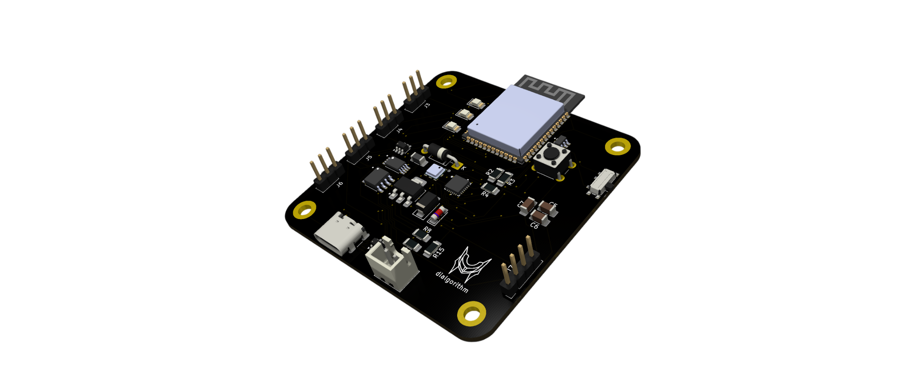
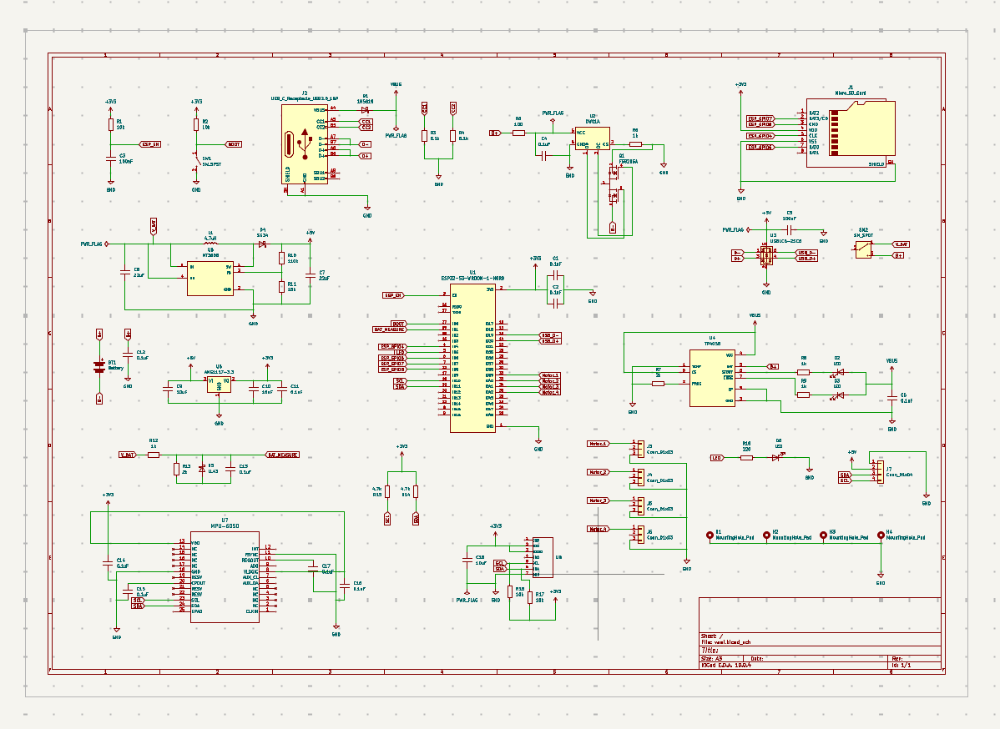
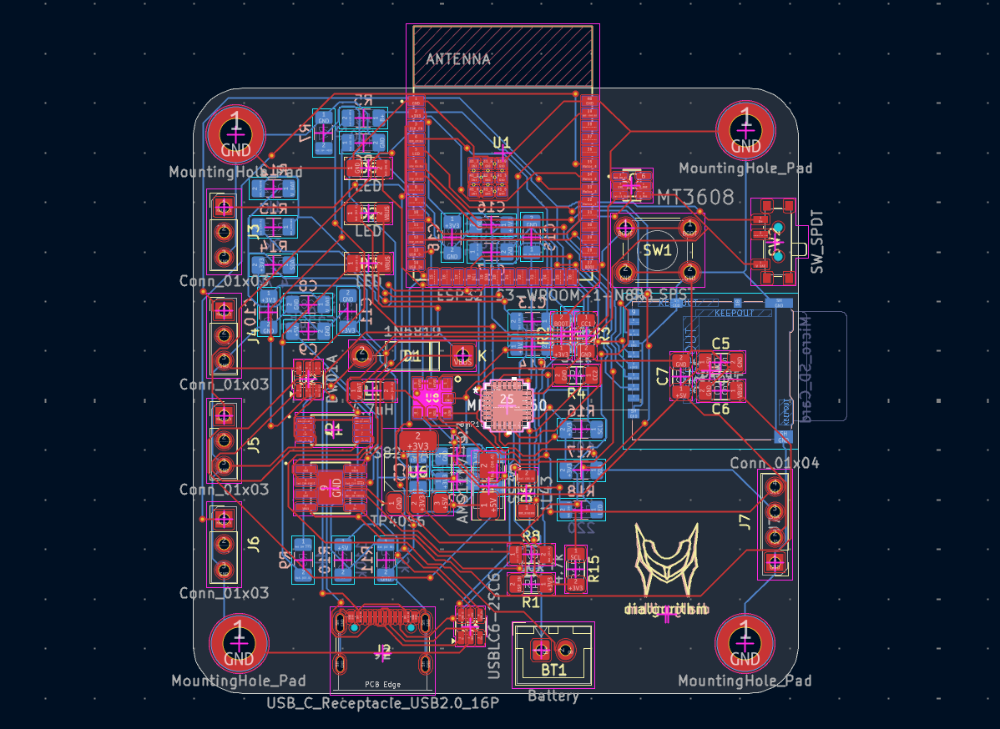
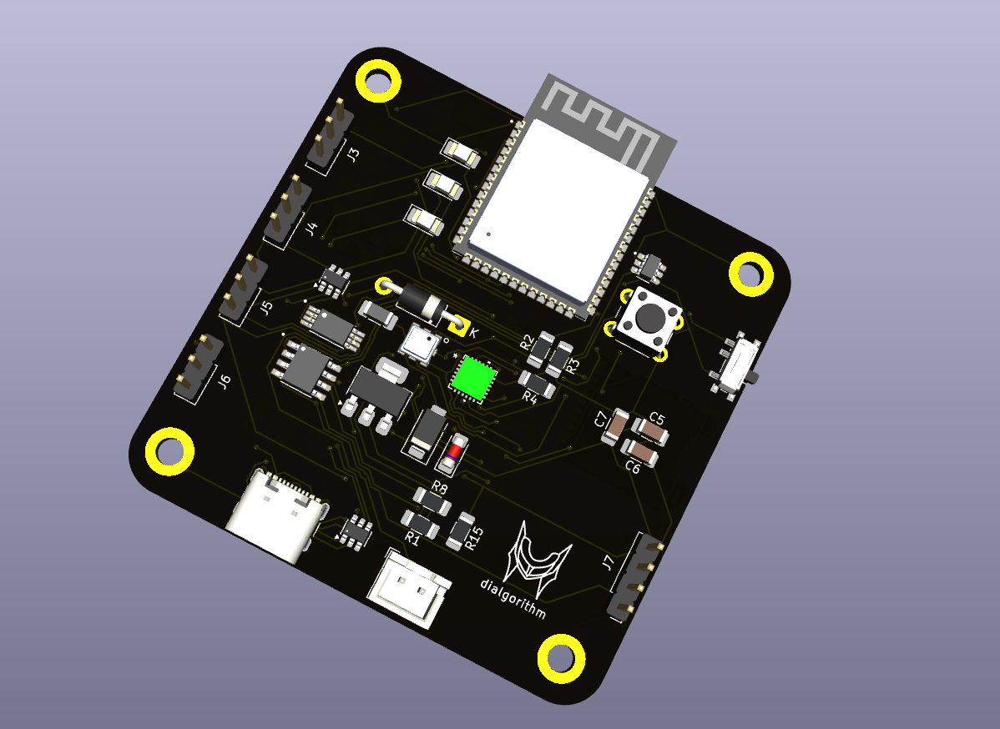

<h1 align="center">
  vael
   
</h1>

<h4 align="center">
an esp32s3 (n8r8) flight controller designed for data logging, sensor measurement, and embedded flight applications.
</h4>

## it features

- **ESP32-S3-WROOM-1-N8R8** as the main controller
- **MPU6050** 3-axis accelerometer and gyroscope for motion and orientation data
- **BMP180** digital pressure sensor for pressure and altitude-related measurements
- **MicroSD card storage** for flight data logging
- **USB-C connectivity** for programming, debugging, and data transfer
- **TP4056-based LiPo charging** circuitry
- **DW01A battery protection** for LiPo protection
- **MT3608 boost converter** for generating the required higher-voltage rail
- **AMS1117-3.3 LDO** for regulated 3.3 V power
- **USBLC6-2SC6 ESD protection** for USB protection

## design

**vael** is designed to keep the electronics compact while providing enough space for sensors, power circuitry, storage, and connectivity.

the board is built around the **esp32-s3-wroom-1-n8r8**, with the supporting electronics integrated onto a custom pcb. it combines the **imu, pressure sensor, microsd storage, usb-c interface, battery charging, protection, and voltage regulation** into a single compact board.

the layout keeps the sensing and processing electronics centralized while separating the power and signal sections. the **mpu6050** and **bmp180** are positioned for consistent sensor measurements, while the **microsd slot, usb-c connector, battery connector, reset button, and mode switch** are accessible from the board edges.

the board primarily uses **smd components**, including 1206 passives and compact sensor packages, to maintain a small form factor while providing the hardware required for **data collection, logging, and embedded flight applications**.

## Schematics + PCB

| Schematic                           | PCB                    | 3d                       |
| ----------------------------------- | ---------------------- | ------------------------ |
|  |  |  |

## BOM

the complete bill of materials is available in [`bom.csv`](bom.csv).
